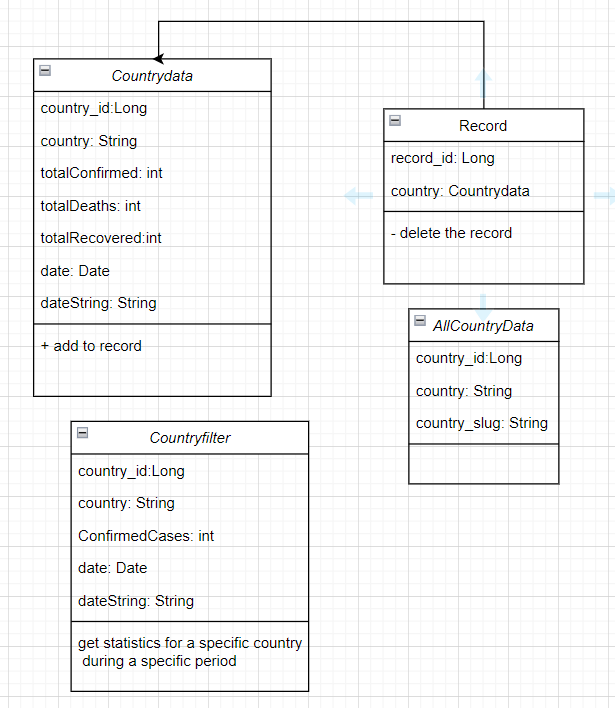
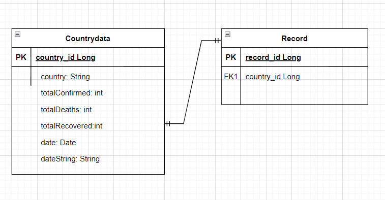

# Covid-19  

## create a simple webapp which provides the users with all the updates on Covid-19 statistics around the world that are retrieved from [COVID-19 API](https://documenter.getpostman.com/view/10808728/SzS8rjbc#27454960-ea1c-4b91-a0b6-0468bb4e6712)

## **User Stories**  

## **Story #1**

----------------------------------------------------------------------------------------------------------------------------------------

### **Get the World Total Statistics**  

#### In **Home**, the user wants to get the World Total Statistics for COVID-19 using this [endpoint](https://api.covid19api.com/world/total) to be displayed as cards for the total confirmed, deaths and recovered cases  

### **Feature Tasks:**

#### **- Get the World Total Statistics for COVID-19 by requesting the API**  

#### **Acceptance Tests:** make sure the user get the Statistics  

#### Estimate your User Stories: small  

## **Story #2**  

----------------------------------------------------------------------------------------------------------------------------------------

### **Filtering**  

#### The user wants to have the ability to get the Covid-19 statistics for a specific country during a specific period of time using this [endpoint](https://api.covid19api.com/country/south-africa/status/confirmed?from=2020-03-01T00:00:00Z&to=2020-04-01T00:00:00Z)  

### **Feature Tasks:**  

#### **- Get the All countries name so the user can determine which country want to know the statistics**  

#### **- Make Query to find the statistics during a specific period of time**  

#### **- save the result to the Filtered data**  

#### **- Show the result to the user as a card**  

#### **Acceptance Tests:** Ensure that the user get the all data she/he request  

#### Estimate your User Stories : Extra Large  

## **Story #3**  

----------------------------------------------------------------------------------------------------------------------------------------

### **Statistics for all the countries**

#### the user wants to get the COVID-19 statistics for all the countries in the world that are retrieved from this [endpoint](https://api.covid19api.com/summary)  

### **Feature Tasks:**  

#### **- Request the statistics for all the countries from the API**  

#### **- show the result as cards**

### **Acceptance Tests:** Ensure that the users can see the all statistics for all the countries  

#### Estimate your User Stories : Large  

## **Story #4**

----------------------------------------------------------------------------------------------------------------------------------------

### **Add the Country to the Record**

#### As a user, can add teh country to the record List  

### **Feature Tasks:**

#### **- Add the country  to the record list.**

#### **- Save the record List changes.**

#### **Acceptance Tests:** Ensure that the country  successfully save into database

#### Estimate your User Stories : Small  

## **Story #5**

----------------------------------------------------------------------------------------------------------------------------------------  

### **view all the records**  

#### as a user can see all the country records he/she added  

### **Feature Tasks :**

#### **- get the records from the database and show it as cards**

#### **Acceptance Tests:** Ensure that the user can see all the recordes she/he added  

#### Estimate your User Stories : Small  

## **Story #6**  

----------------------------------------------------------------------------------------------------------------------------------------  

### **Delete Record**

#### as a user can delete spesific country from the record list  

### **Feature Tasks :**

#### **- update on database**  

#### **Acceptance Tests:** Ensure that the user can see all the recordes after deleting the one she/he wants  

#### Estimate your User Stories : Large

----------------------------------------------------------------------------------------------------------------------------------------

## Domain Modeling

----------------------------------------------------------------------------------------------------------------------------------------

## DataBase Schema Diagram

  
----------------------------------------------------------------------------------------------------------------------------------------
  
## The Database

* start the sql server  
* type **psql**  
* **CREATE DATABASE covid19;** create the database.
* **\c covid19;** To connect to the database  
  
## The application.properties File

server.port=8082
spring.datasource.platform=postgres
spring.datasource.url=jdbc:postgresql://localhost:5432/covid19
spring.datasource.username=alaa
spring.datasource.password=
spring.jpa.hibernate.ddl-auto=update
spring.datasource.initialization-mode=always  

----------------------------------------------------------------------------------------------------------------------------------------  

[Link To the Project Question](https://github.com/AlaaYlula/Covid-19/blob/main/Project/1st-inter-task-Java.md)  
